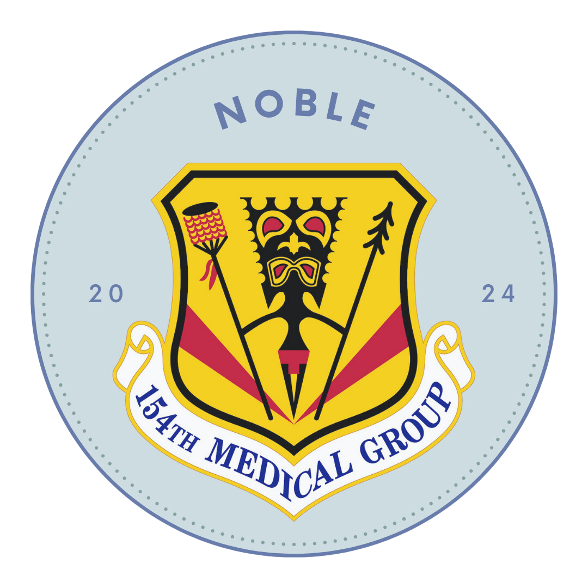

## Table of contents

- [Overview](#overview)
- [Problem](#problem)
- [Deployment](#deployment)
- [User Guide](#user-guide)
- [Development](#development)
- [Team](#team)
- [Community Feedback](#community-feedback)

## Overview

Noble is a web app designed to support the medical readiness of Hawaii Air National Guard (HIANG)service members by providing reliable, anonymous, and accessible health information. Noble includes three main features:

- **Frequently Asked Questions (FAQ):** A searchable and sortable database of straightforward answers to common medical questions.

- **Question Compass:** An AI chatbot trained on Air Force Medical Standards and procedures to provide personalized guidance.

- **Ask A Doc:** An anonymous platform for users to submit medical questions when they cannot find answers elsewhere.

## Problem

Medical readiness is essential for maintaining membership in the Hawaii Air National Guard (HIANG), with requirements varying by career field. For instance, flight crew members facestricter medical standards than those in administrative roles. The 154th Medical Group (154 MDG) oversees medical readiness for 2,300 HIANG members, following complex procedures and guidelines. However, concerns about the potential career impacts of disclosing medical issues discourage members from seeking help, even anonymously.

Despite implementing an anonymous “Ask a Doc” dropbox for questions, no queries have been submitted in three months, highlighting a lack of trust in the process. Members fear that revealing medical conditions could lead to restrictions or separation from service.

## Deployment

View our V1 website application here: [noble.wiki](https://noble.wiki/)

### V1 Tech Stack

- [Meteor](https://www.meteor.com/)
- [React](https://react.dev/)
- [React Bootstrap](https://react-bootstrap.github.io/)
- [MongoDB](https://www.mongodb.com/)
- [OpenAI](https://openai.com/)
- [TestCafe](https://testcafe.io/)

### V2 Tech Stack

- [Next.js](https://nextjs.org/)
- [tailwindcss](https://v3.tailwindcss.com/)
- [shadcn/ui](https://ui.shadcn.com/)
- [MongoDB](https://www.mongodb.com/)
- [OpenAI](https://openai.com/)

## Activity Badges

**Noble V1:**

**Noble V2:**

## User Guide

This section provides a walkthrough of the Noble user interface and its capabilities.

### Landing Page:

The landing page is presented to users when they first visit the site. It provides a brief overview and purpose of the app.

### Frequently Asked Questions (FAQ):

A searchable and sortable database of straightforward answers to common medical questions. Users can filter based on categories and search by keywords.

### Question Compass:

Meet Noble AI, our chatbot trained on Air Force Medical Standatds and procedutes. It can provide personalized guidance based on the question asked. Noble AI is trained to not answer questions that are not related to its data.

### Ask A Doc:

Couldn't find an answer? Ask A Doc! Use our anonymous platform to submit medical questions. To maintain privacy and security, a passcode system is employed to ensure only service members have access.

## Development

The following describes the development process of our app:

## Milestone 1 (January 20 - February 7, 2025)

Milestone 1 is the reintroduction to Noble, worked on as a capstone project in continuation of engineering management.

### Week 1

The team met with the sponsor to discuss the progress of Noble and to gather feedback on the current implementation. During the meeting, the sponsor provided valuable insights into it's currently procedures and plans to further integrate Noble into their workflows.

As of now, Noble was introduced to the 154th Medical Group internally with optimism. It however requires further approval from higher leadership and a workflow plan for answering submitted questions.

The team and the sponsor agreed on several new features and improvements to enhance the user experience and address any existing issues. This collaboration ensures that Noble continues to meet the needs of the Hawaii Air National Guard service members effectively.

### Week 2

Development has officially begun, with the tech stack finalized. After learning about the numerous hurdles of Noble V1, V2 aims to modernize its technologies using Next.js, Tailwind CSS, Shadcn/ui, and MongoDB. This week’s focus will be on transitioning the current V1 Noble public pages to the new tech stack.

During our weekly sponsor meeting, a university student from Colorado State University has reached out and shown interest in joining our team. We will interview them and decide if they can join the team.

Additionally, our sponsors emphasized the importance of increasing awareness about Noble within the 154th Medical Group. To address this, we developed a February newsletter announcing that Noble is now live and operational. The newsletter was distributed before the weekend drill, ensuring that service members were informed about the platform and its potential benefits.

### Week 3

Tara Walsdorf, a student from Colorado State University, has officially joined our team. We conducted an onboarding session to familiarize them with our current implementations, team expectations, and development roadmap. Their addition to the team brings valuable skills and an external perspective that could further enhance the project.

Throughout the week, we focused on continuous integration efforts for the website, ensuring that new changes are seamlessly incorporated into the system. During our weekly sponsor meeting, we presented our progress, including the successful migration of key components from Noble V.1 to the new technology stack. We also addressed sponsor feedback and discussed upcoming development goals. These regular check-ins allow us to refine our approach and ensure that the project remains aligned with user needs.

## Milestone 2 (February 10 - February 21, 2025)

### Week 4

As part of our continued modernization efforts, we have begun transitioning the backend of Noble to Next.js. This shift aims to improve performance, scalability, and maintainability while streamlining the integration of new features. The backend transition is a crucial step in enhancing Noble’s capabilities, allowing for more efficient data management and improved responsiveness.

In addition to backend development, we have been refining the user interface to ensure a more intuitive experience. The team has focused on optimizing navigation, enhancing accessibility, and incorporating feedback from our sponsors to make the platform more user-friendly. These refinements are essential to increasing adoption and ensuring that service members can easily navigate and utilize the platform’s features.

### Week 5

The team had a significant meeting with the 154th Unit Health Monitors (UHMs) to introduce Noble and explore how it can be integrated into their existing systems as a valuable resource. The discussion centered on the platform’s potential to streamline communication, manage health-related inquiries, and support the UHMs in their daily operations.

During the meeting, we provided a live demonstration of Noble’s features, highlighting its ability to improve efficiency within the medical group. The UHMs shared their thoughts on the platform and provided feedback on potential enhancements that would make it more tailored to their needs. This collaboration was instrumental in identifying additional functionalities that could be incorporated in future iterations of Noble.

Moving forward, we plan to implement the suggested improvements, refine workflows based on UHM requirements, and continue working on backend development. By maintaining open communication with our stakeholders, we ensure that Noble remains a dynamic and evolving solution that effectively serves HIANG’s needs.

## Milestone 3 (February 24 - March 7, 2025)

### Week 6

The transition of Noble to Next.JS has continued with progress going smoothly. Currently, all public pages are completed and updated with new feedback and bug fixes. Development is now focused on the MDG side and securing the public pages with captchas. To ensure Noble suceedes, the team is working to produce flyers and newsletters to spead the word. Furthermore, we plan to conduct more user testing and feedback in the comming weeks.

### Week 7

The development team focused on laying the foundation for the medical side dashboard and internal functionalities. The goal was to begin converting the MDG interface pages while ensuring compatibility with the backend infrastructure already transitioned to Next.js. We mapped out user flows for healthcare professionals and organizing how question submissions would be stored, sorted, and displayed.

Simultaneously, we finalized the first drafts of promotional materials including a flyer and informational one-pager intended for the 154th Medical Group. These resources aim to clarify Noble’s features and encourage staff to participate in feedback sessions. The flyers were shared with our sponsor for review and are expected to be distributed during the next weekend drill. Overall, this week was a productive mix of backend planning, UI prototyping, and strategic outreach to increase user engagement.

## Milestone 4 (March 10 - March 28, 2025)

### Week 8

We started to shift our attention to actively developing and converting key medical group related pages. This included the Medical Home page, which acts as a landing space for medical staff, and the question management page, which allow authorized personnel to view, respond to, and track inquiries. We ensured that the layout remained intuitive and accessible while incorporating visual elements consistent with the public side of Noble.

### Week 9

Spring recess. The team got a chance to recharge, and we will meet the following week for any updates and sharing next steps.

### Week 10

Following Spring Break, we resumed active development by implementing CAPTCHA to improve the security of Noble’s forms. This addition helps verify whether a human is interacting with the platform, which is especially important given that the question submission form could otherwise be vulnerable to spam or bot entries. After integrating the CAPTCHA component, we began testing its behavior across devices and made sure it did not disrupt the user experience.

Simultaneously, debugging efforts ramped up on the medical side pages. We began testing routes related to medical staff login, access permissions, and dashboard functionality. These continuous enhancements move Noble closer to being a comprehensive and secure platform for both public users and medical staff.

## Milestone 5 (March 31 - April 18, 2025)

### Week 11

The team is still in continuous integration and debugging of the medical side features. One major area of focus was the feedback management page, which allows medical personnel to view inquiries submitted by users, and see if there are any additional things that we could improve on. We worked on ensuring smooth transitions between different states such as viewing open questions, responding, and archiving resolved tickets.

We have also tested backend routes to guarantee reliable database interactions, especially for logging staff responses and status changes. We are still looking at the implementation of CAPTCHA, as we need it to work with other features of Noble. With development nearing the finish line, these refinements are vital for making Noble a trustworthy and efficient platform that integrates seamlessly into the medical team’s workflow.

### Week 12

This week was a milestone moment for the team, as we conducted a live demonstration of Noble with members of the 154th Medical Group during their drill on Sunday. The goal was to walk through the key features of both the public and internal facing sides of the platform, gather real-time feedback, and discuss how Noble could be adapted further to fit their needs. Their feedback was overwhelmingly positive, with several members expressing enthusiasm about its potential to improve communication and workflow.

Participants provided constructive feedback on areas such as visibility of answered questions, adding on more questions to the FAQ, and suggestions for certain features. Following the demonstration, we compiled all comments into an checklist to guide our remaining weeks of development. This feedback loop was essential, reinforcing that our user-centered design approach was on the right track and giving us the insight needed for the final rounds of updates.

## Team

Noble (v.2) is designed and implemented by Rina Ogino, Thomas Rivera, and Tara Walsdorf.

Noble (v.1) is designed and implemented by Lauren Clayton, Rina Ogino, Thomas Rivera, Ryne Stagen, and Brandon Underwood.

## Community Feedback

We are interested in your experience using Noble! Please take a couple of minutes to fill
out the [Noble Feedback Form](https://noble.wiki/feedback).
